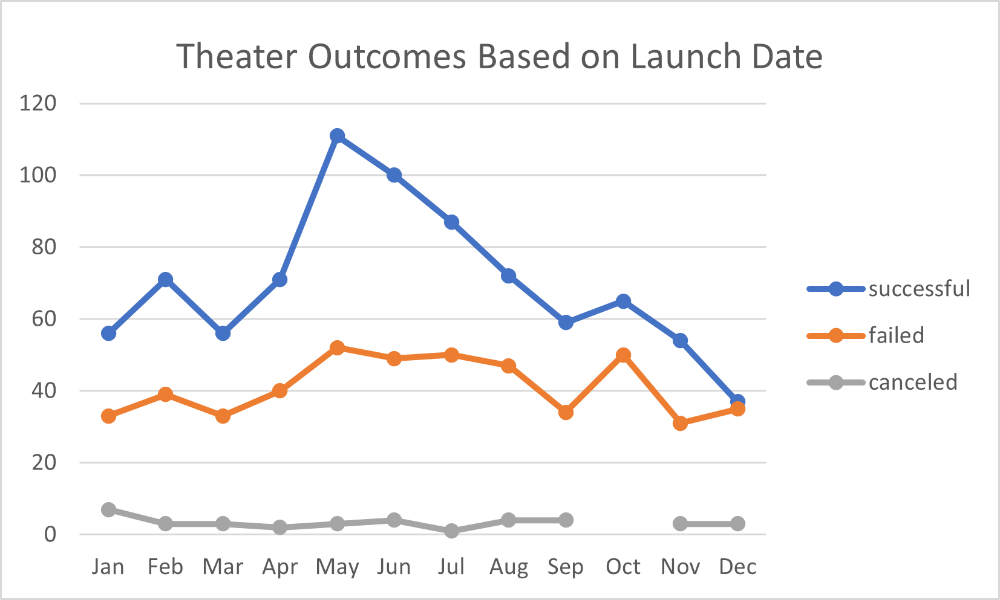
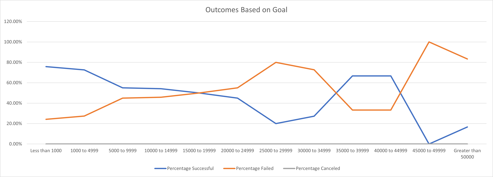
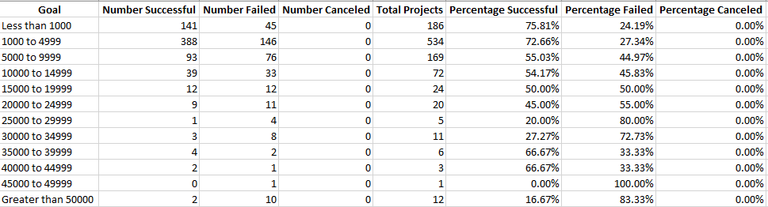

# Kickstarting with Excel

## Overview of Project

### Purpose

This project is to uncover the trends regarding how various factors influence the Kickstarter campaign outcomes by looking at over 4,000 past Kickstarter campaigns in the dataset.

## Analysis and Challenges

### Analysis of Outcomes Based on Launch Date

This analysis focuses on parent category _theater_. It is analyzing how launch date influences the outcome.

From the graph below, we can tell that the launch date do play an important role. Overall, May, June and July are the best months to launch, in that order. While winter is not good for launching, especially December.

### Analysis of Outcomes Based on Goals

This analysis focuses on subcategory _plays_. It is analyzing how goals influences the outcome.

From the graph below, it is not clear whether amount of goal impacts the outcome.

But if we look at the exact amount of entries instead of percentage, we can ignore the data with a goal over 15000 since there is too little data, shown below.

When we look at data from _less than 1000_ to _10000 to 14999_, we can conclude that a small amount of goal helps the campaign to be successful.

### Challenges and Difficulties Encountered

One challenge that I encountered is I cannot find how goal influences outcomes at first glance of the graph. After looking at the actual data, I realize this might be because there aren't enough data for when the amount of goal is big.

## Results

- What are two conclusions you can draw about the Outcomes based on Launch Date?
  - May is the best month for launching.
  - December is the worst.

- What can you conclude about the Outcomes based on Goals?
  - Having a small goal helps succeed.

- What are some limitations of this dataset?
  - There are not enough data entries.
  - The data are from 2009 to 2017, it does not include the data for closer years.

- What are some other possible tables and/or graphs that we could create?
  - Analysis of Outcomes Based on how long the campaign lasts. i.e. _deadline_ - _launched_at_
  - Analysis of Outcomes Based on countries.
